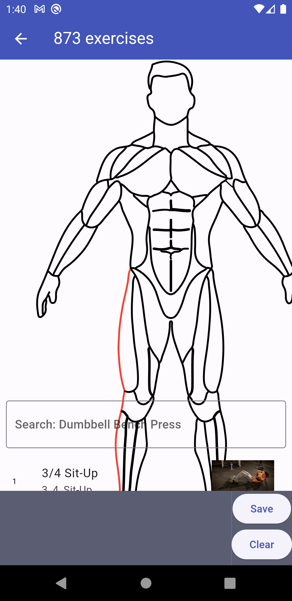

# Fitness Programı Uygulaması7

## Yapılacaklar

- uygulama ui toparla
- dediğin karmaşayı da cozcem
- sonra filtre
- loginsiz giriş yapma kaydetme
- kas tıklama(filtreleme özelliği olarak)
- çeviri 
- ek geri bildirim loading
- create ekranında egzersiz silme yok. Program detaydaki componenti al
## EN SON ZAMAN KALIRSA CUSTOM PAINT ILE KAS SECIMI YAPILABILIR
  

# not priority
- movement detail screende radius buttons ile hareketin kasları vb zellikleri gösterebilirim sonra
- EGER KULLANICI GIRIS YAPMADIYSA YEDEKLEME YAPAMAZ BİR LOGINE YONLENDIR OLUR BITER TEKRARDAN.fARKLI BİR HESAPTAN GIRIS TE AYNI HATAYI VERIYO
- BASLANGICTA KULLANICININ GIRIS YAPMASINA GEREK DUYMADAN ISLEMINE DEVAM EDEBİLME EKLE.
- exersiz filtrelemeleri kas grubu etc.
- resimler yüklenirken bir shimmer eklenmeli
- PROJE BITEYAZINCA PRINTLERI SIL
# done
- hata acaba bizim frommaplerde filan mı ? 
- BAZEN AYNI ISIMDE OLAN PROGRAMLARDA EXERCİSLERİ 3 KATINI EKLEYEBİLİYOR
- assetteki json verileri en başta oku ve getx modeline ekle (sürekli okuma yapmasın yani)
- resimlerin internetten yüklenmesi zor olabilir bunun için iki özellik var
  - resimlerin internetten yüklenmesi
    - Şimdilik bu fikirden ilerlencek interneti ve cihazı zorlamaması adına cache ve pagination eklenebilir. 
  - resimlerin assette olması ✅
- Her seyi stateless yapmaya çalış
- egzersizleri birbiri ardında yer değiştirilebilir yap.
- giris cikis islemlerinde depolamalarını temizlemeyi unutma.
- profil ekranında kullanıcının bilgilerini göster
- sifre degistirme kodu ekle
- sifremi unuttum spring halletsin.
- app icon
- splash screen
- email validasyonu ekle
- DİO EKLEDIM TUM FROMJSONLARI FROMMAP YAP
- INTERNET SERVISININ ÇALIŞIP ÇALIŞMADIĞINI GÖSTEREN BİR GÖSTERGE EKLE. TİMEOUT SÜRESİNİ AYARLA HTTP BASE AYARLA 
- springde program snyclemeyi değiştirmeyi access_tokenden o kişinin programlarını getirerek yap
- İSSUE hiç egzersizi olmayan program sync edilmez
- 403 hataları için(süre dolması veya ayni mailden baska cihazdan giris yapılması) bir hata sayfası ekle tekkrardan giriş yapmasınıı sağla
- dockerize spring boot and mysql
- canlıya al
